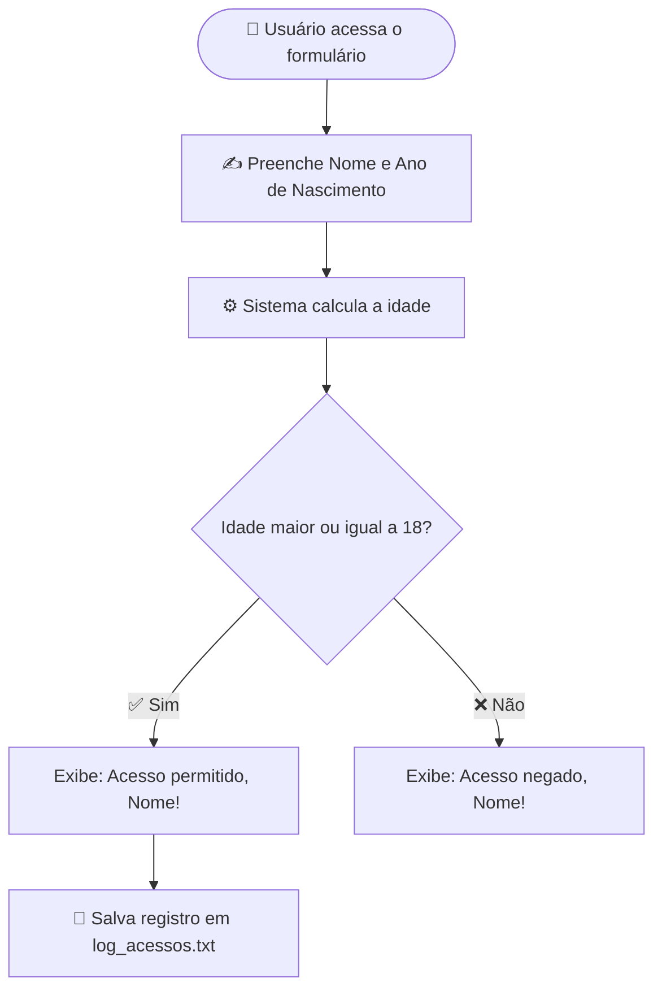

<div align="center">

# 🔐 Verificador de Maioridade

### Sistema em PHP que calcula a idade do usuário e libera (ou não) o acesso — com registro automático em log


[](https://opensource.org/licenses/MIT)


</div>

<br>

---

## 📑 Sumário

- [💡 Sobre o projeto](#-sobre-o-projeto)
- [🔄 Como funciona](#-como-funciona)
- [✨ Funcionalidades](#-funcionalidades)
- [🛠️ Tecnologias utilizadas](#-tecnologias-utilizadas)
- [📁 Estrutura do repositório](#-estrutura-do-repositório)
- [▶️ Como executar](#-como-executar)
- [🧪 Exemplo de uso](#-exemplo-de-uso)
- [📚 Conceitos aplicados](#-conceitos-aplicados)
- [👨‍💻 Autor](#-autor)

---

## 💡 Sobre o projeto

> Um pequeno sistema PHP que resolve, em poucas linhas de código, uma pergunta simples: **"Você já fez 18 anos?"**

Este projeto foi desenvolvido como atividade prática, com o objetivo de exercitar conceitos fundamentais do PHP: formulários, lógica condicional, manipulação de datas e escrita em arquivos.

---

## 🔄 Como funciona



---

## ✨ Funcionalidades

| Recurso | Descrição |
|---|---|
| 📝 Formulário dinâmico | Coleta o nome e o ano de nascimento do usuário |
| 🧮 Cálculo automático | Calcula a idade com base no ano atual |
| 🔓 Controle de acesso | Libera ou nega o acesso conforme a idade calculada |
| 🗂️ Log de acessos | Registra automaticamente todos os acessos permitidos |

---

## 🛠️ Tecnologias utilizadas

<div align="center">


</div>

---

## 📁 Estrutura do repositório

```
📦 verificador-de-maioridade
 ┣ 📜 5a_desafio1.php     → Código principal do desafio
 ┗ 📄 log_acessos.txt     → Gerado automaticamente após o primeiro acesso permitido
```

---

## ▶️ Como executar

### Pré-requisitos
- ✅ PHP instalado (versão 7.4 ou superior)

### Passo a passo

```bash
# 1️⃣ Clone este repositório
git clone https://github.com/seu-usuario/verificador-de-maioridade.git

# 2️⃣ Acesse a pasta do projeto
cd verificador-de-maioridade

# 3️⃣ Inicie o servidor embutido do PHP
php -S localhost:8000
```

Depois, acesse no navegador:

```
http://localhost:8000/5a_desafio1.php
```

---

## 🧪 Exemplo de uso

<div align="center">

| Nome | Ano de Nascimento | Idade | Resultado |
|:---:|:---:|:---:|:---:|
| Maria | 2000 | 26 | ✅ **Acesso permitido, Maria!** |
| João | 2015 | 11 | ❌ **Acesso negado, João!** |

</div>

> 💾 A cada acesso permitido, uma nova linha é adicionada em `log_acessos.txt`, no formato `Nome - Idade anos`.

---

## 📚 Conceitos aplicados

- [x] Formulários HTML e envio via `POST`
- [x] Superglobal `$_SERVER["REQUEST_METHOD"]`
- [x] Estruturas condicionais `if / else`
- [x] Manipulação de datas com `date('Y')`
- [x] Escrita em arquivos com `file_put_contents()`

---

<div align="center">

## 👨‍💻 Autor

**Vinycius**

Feito com 💙 e bastante café ☕

⭐ **Se este projeto te ajudou, deixe uma estrela no repositório!**

</div>
